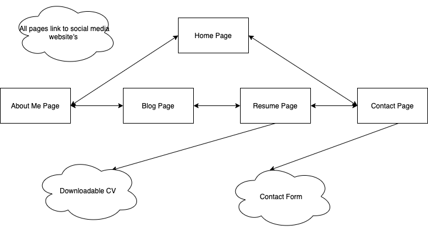
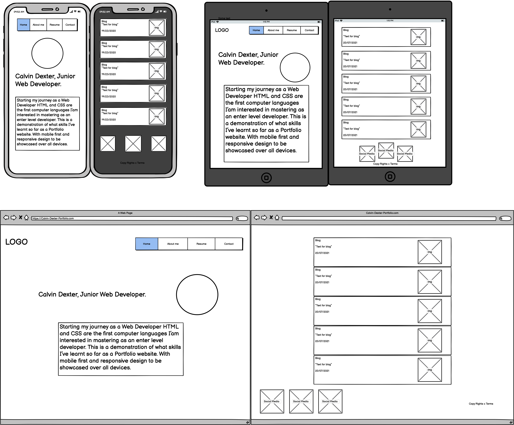
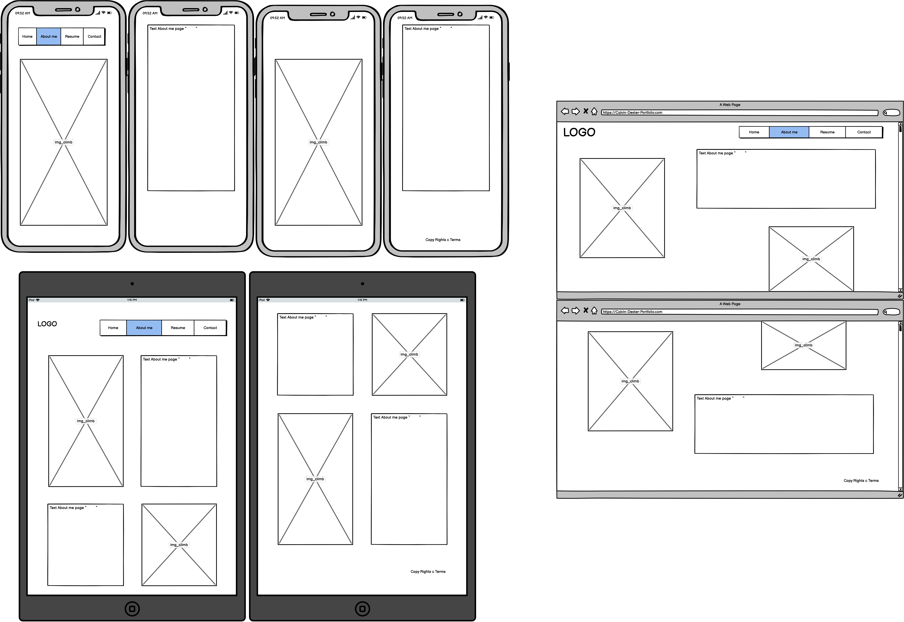
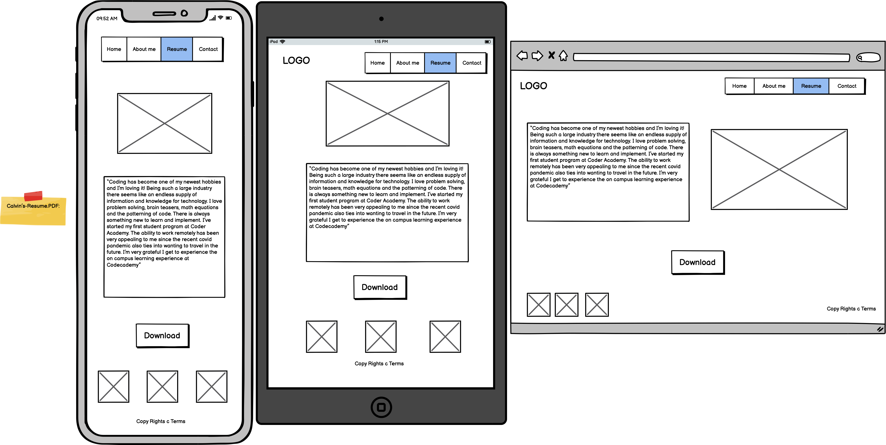
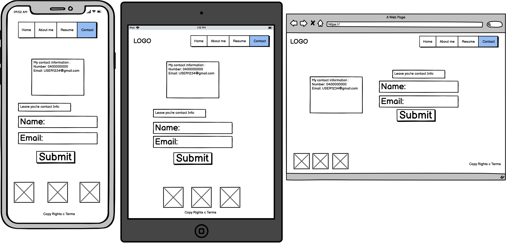

# CalvinDexter_T1A2
My Portfolio Website, for Coder Academy Term 1 assessment 2
### Link to Portfolio Website
(https://calvindexterportfolio.netlify.app/)

### Link to GitHub Repositories
(https://github.com/calvdext/CalvinDexter_T1A2)

### Description 
This Website has been created as a professional platform to introduce myself and my skills and knowledge of HTML and CSS while simultaneously using web developing tools such as wireframe's, github repo, HTML, CSS and deployment. The site itself is a 5 page website with a Home, About Me, Blog, Resume and Contact page with a mobile first design, media queries to accommodate for screen sizes of a mobile, tablet and desktop. Focusing on SCSS to get a better understanding of the fundamental concepts that will help me progress forward.
### Purpose
The purpose of this website is to show potential employers some of my web development skills and my personality. But for myself it’s a learning project that I feel has given me a lot of experience and knowledge of building a website from and empty enviroment. Taking time to plan and make content for this project had its benefits for the building process and having wireframes and site map to reference made this project all come together without any major issues. 

### Functionality / features
- Nav Bar
- Mobile first design 
- Media queries
- Blog section
- Downloadable CV
- Contact form 
- Links to social media 

The code choice for the styling I’ve used is SASS converted into CSS, this allowed me to do nesting in the building process. I could of gone without this but still I wanted to use a SASS file to get the feel for using it. The Media queries are used on each styling sheet to best suit the wireframes in designed. Some things I would of like to add and play around with is some animation, some colorful shapes moving past in the back-ground and how to make that work cohensiding the media break points. 
### Target audience
The target audience for this project is an employer seeking a junior web developer, all thought this website is very basic and doesn't have any JS features, I'm excited with the out come non the less and can’t wait to dive deeper into more complex code.

### Screenshots / Wireframes / Site Map

### Tech stack 
- VS code 
- GitHub
- HTML
- SASS/CSS
- Netlify